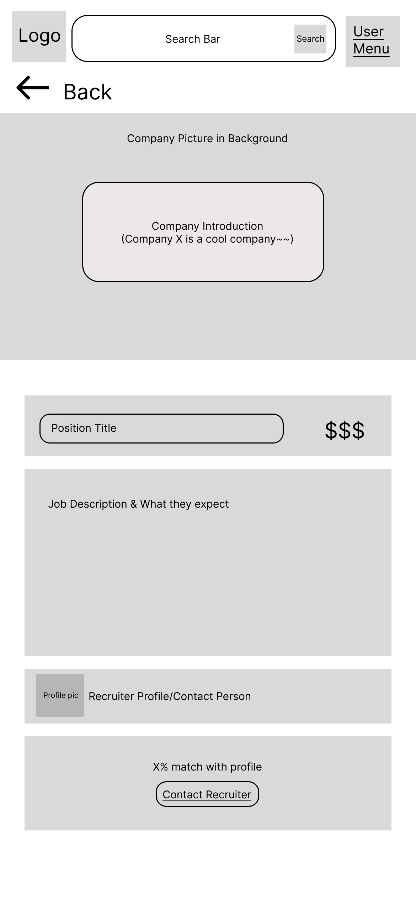

# User Experience Design

This repository contains instructions and files for two assignments that together comprise the user experience design phase of a web app.

Replace the contents of this file with the completed assignments, as described in:

- [app map & wireframe instructions](instructions-0a-app-map-wireframes.md).
- [prototype instructions](instructions-0b-prototyping.md)

> ## [TesterConnector Prototype on Figma](https://www.figma.com/proto/PimAf8no5JKQo8u2jWVifd/Tester-Connector?node-id=1%3A3&scaling=min-zoom&page-id=0%3A1&starting-point-node-id=1%3A3)
[Link](https://www.figma.com/proto/PimAf8no5JKQo8u2jWVifd/Tester-Connector?node-id=1%3A3&scaling=min-zoom&page-id=0%3A1&starting-point-node-id=1%3A3)

 
 

# [App Map](https://app.diagrams.net/?src=about#G1YDXIvWCTYoabwn2q6m4KW9jER4VrwIQR)

 

# [Wireframes](https://www.figma.com/file/PimAf8no5JKQo8u2jWVifd/Tester-Connector?node-id=0%3A1&t=HW00Osw2jAYHLdEX-0)

## Sign Up/ Login
Sign up or login flow that allows the user to sign in to their account or to create their account.

## Profile Set up
First time profile set up for the user that allows them to create their account.

## Main Page
Landing page, entices users to sign up or search for positions. This is what a user would see before logging in (log-in, CTA to sign in).

## Main Page (after login)
Landing page, entices users to sign up or search for positions. This is what a user would see after logging in (no log-in, no CTA to sign in).

## List of Freelancers
For businesses, search a list of freelancers that you could contact and connect with.

## Freelancer Info Page
Learn about the freelancer. Background on who they are and what may qualify them for the position.

## Search for Positions
For freelancers, search for possible positions that companies are offering.

## Position Info
Learn more about a position. I.e. what company is posting it, what the work is, what would be required to be successful.

## Recruiter Pop-up
A popup with information on the recruiter that helps potentially interested candidates learn more/ask questions.

## Profile Settings
Change the settings of your profile.

## Saved Positions
Go to a list of positions you have saved. Like a "favorited" positions that a freelancer may come back to.

## Saved Freelancers
For a business user. Go to a list of freelancers you have saved. Like a "favorited" section. These could be freelancers with good qualifications or someone the business has worked with in the past.

## Recruiter Profile
The profile for a business and the recruiter from that business.

