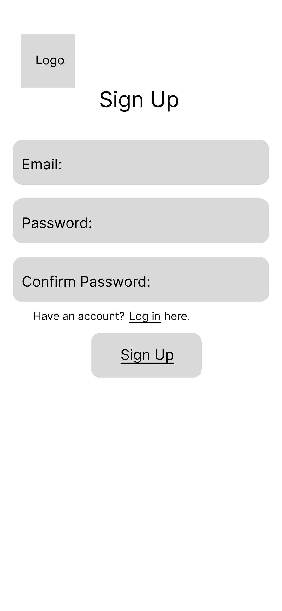

# User Experience Design

This repository contains instructions and files for two assignments that together comprise the user experience design phase of a web app.

Replace the contents of this file with the completed assignments, as described in:

- [app map & wireframe instructions](instructions-0a-app-map-wireframes.md).
- [prototype instructions](instructions-0b-prototyping.md)

> ## [TesterConnector Prototype on Figma](https://www.figma.com/proto/PimAf8no5JKQo8u2jWVifd/Tester-Connector?node-id=1%3A3&scaling=min-zoom&page-id=0%3A1&starting-point-node-id=1%3A3)

 
 

# [App Map](https://app.diagrams.net/?src=about#G1YDXIvWCTYoabwn2q6m4KW9jER4VrwIQR)

 

# [Wireframes](https://www.figma.com/file/PimAf8no5JKQo8u2jWVifd/Tester-Connector?node-id=0%3A1&t=HW00Osw2jAYHLdEX-0)

## Sign Up/ Login

## Profile Set up

## Main Page

## List of Freelancers

